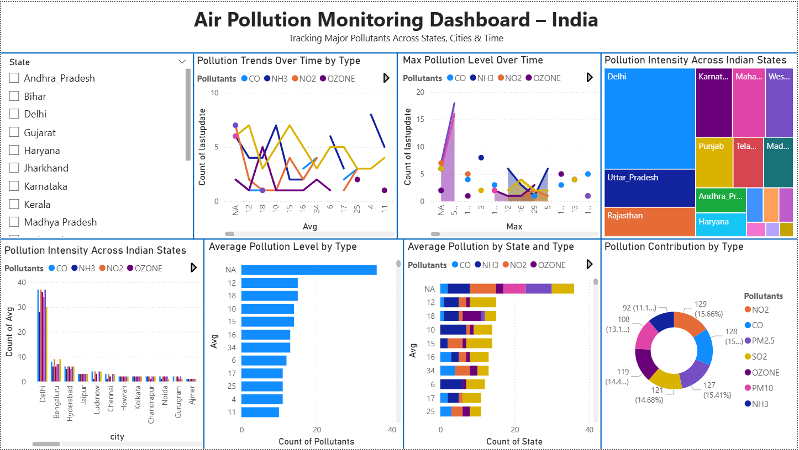
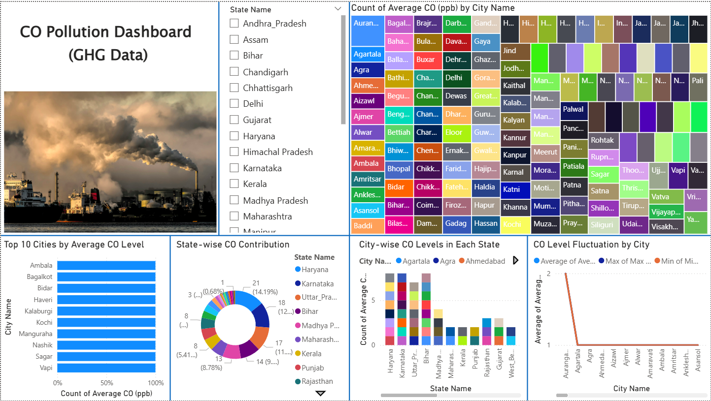
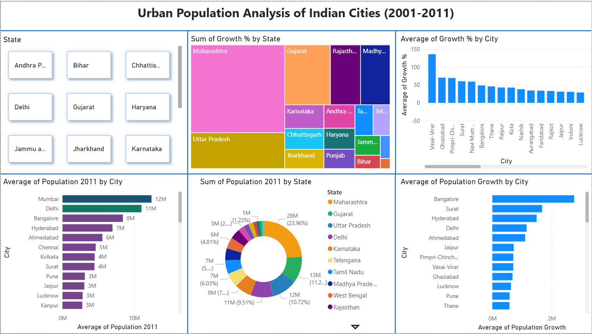
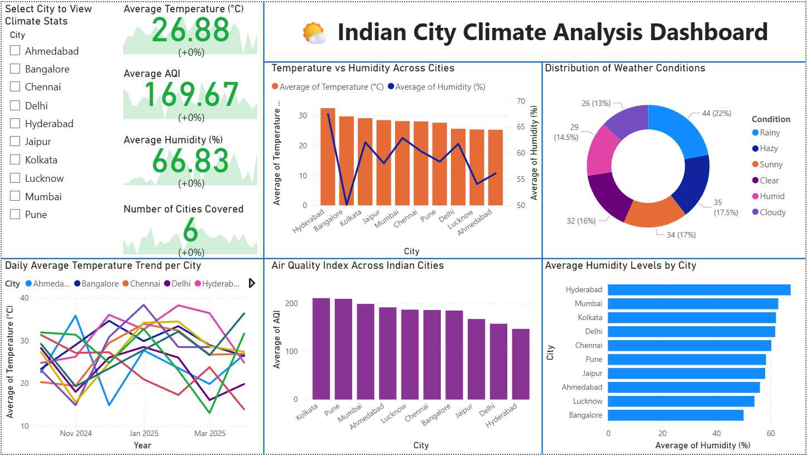

# Environmental Reports: India Data Analysis Portfolio

This repository contains my complete data analytics portfolio focused on exploring critical environmental and demographic challenges across India using **Microsoft Power BI**. The project demonstrates proficiency in the full data workflow: collection, cleaning, modeling, and delivering interactive, actionable dashboards.

---

## 📊 Project Overview (4 Interactive Dashboards)

This analysis is broken down into four key areas, with each dashboard designed for specialized insights:

### 1. Air Quality & Pollution (AQI)

* **File:** `AQI_Pollution_Dashboard.pbix`
* **Focus:** Visualizing Air Quality Index (AQI) trends, comparison of primary pollutant concentrations (PM2.5, NO2, SO2), and identifying most-affected regions and cities.

 

### 2. Greenhouse Gas (GHG) Emissions

* **File:** `GHG_CO_Emissions_Analysis.pbix`
* **Focus:** Detailed analysis of Carbon Monoxide (CO) levels, max/min trends, and identifying potential correlation with industrial areas across various states.

 

### 3. Population and Demographics

* **File:** `India_Major_City_Population.pbix`
* **Focus:** Analysis of population distribution, growth rates, and density within India's largest metropolitan areas (cities with population > 1 million).

 

### 4. City Climate and Temperature

* **File:** `City_Temperature_Climate_Insights.pbix`
* **Focus:** Visualizing temperature, humidity, and weather conditions to identify seasonal patterns and anomalies in major Indian cities.

 

---

## 💡 Key Analytical Insights (What I Found)

*(**IMPORTANT:** Fill in these three points with specific findings you extracted from the data. Do not leave them as placeholders.)*

1.  **[INSIGHT 1: Example - Identified a 15% increase in peak PM2.5 levels during the winter months (Nov-Jan) across North Indian metropolitan areas, suggesting a seasonal regulatory focus.]**
2.  **[INSIGHT 2: Briefly describe a key trend you found in the Population or GHG data.]**
3.  **[INSIGHT 3: Briefly describe a key observation about temperature or air quality correlation.]**

---

## 🛠️ Technology and Data Workflow

* **Primary Tool:** **Microsoft Power BI** (for data modeling, DAX, and visualization).
* **Data Sources:** Multiple **CSV** and **XLSX** files sourced from public domains.
* **Data Transformation:** **ETL process** performed using Power Query (M Language) for data cleaning, merging, and type casting.
* **Repository Structure:** Files are organized into dedicated folders for **Data**, **PowerBI_Dashboards**, and **Dashboard_Previews** for maximum readability.

---
